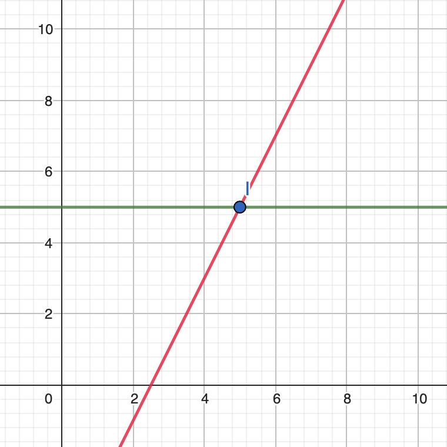

# Fan calibration

After the finding, that no general function can be applied to convert desired speeds to percentages, 
and the decision to handle this issue by implementing a fan speed calibration mechanism, there are 
further questions that need to be answered in order to implement the mechanism.

## The calibration process
The calibration process has the purpose to identify the four numeric values, that make out the 
calibration curve.

This calibration curve has a shape similar to the curve shown in the plot below:

As visible, the fan curve actually consists of two functions, where one is a constant (`b` in the plot) that serves as the baseline and another (`c` in the plot) that increases linearly. The two functions intersect at a single point `I`, that is defined by `I = (ix, iy)`. As of that the four numeric values are:

* `ix`: The duty cycle at the point where changing the duty cycle starts to affect the fan speed
* `iy`: The minimal fan speed
* `m`: The slope of the function `c`, which corresponds to the speed delta of the fan per 1% increase in duty cycle
* `b`: The `y`-component of the intersect of `c` with the `y` axis

## Question to be answered
* How long has the duty cycle be kept constant to get an accurate measurement?
* Is it possible to vary the duration of constant duty cycle to give the user a choice of balance between accuracy and calibration time?
* How reproducible are the measurements and how many iterations are required to get an accurate measurement?